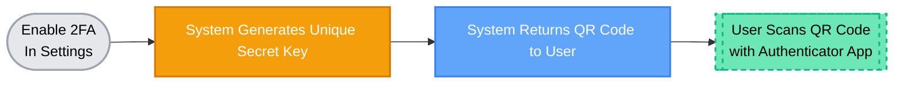
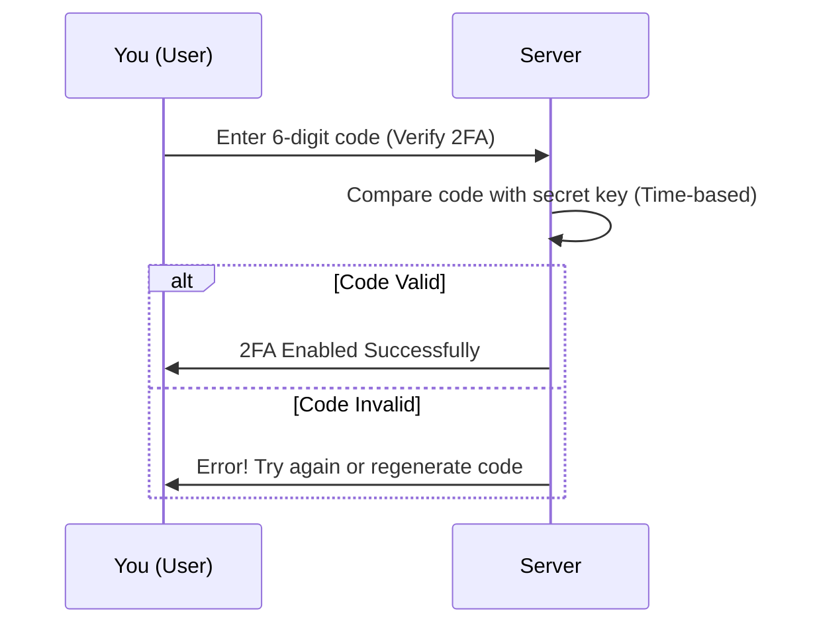
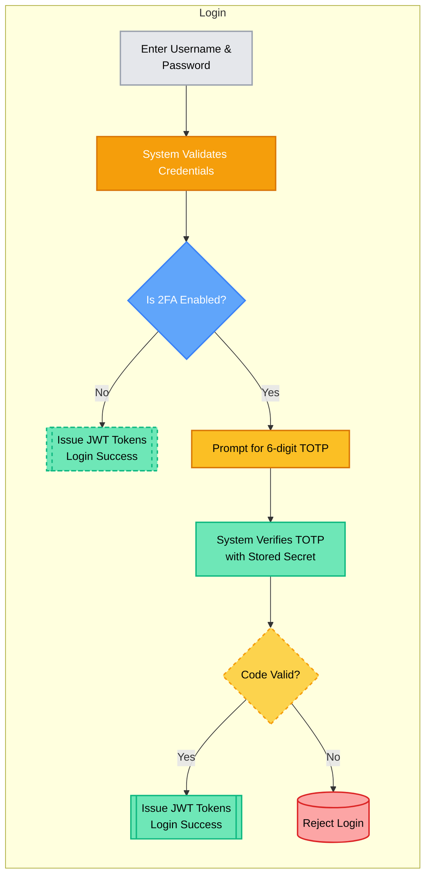
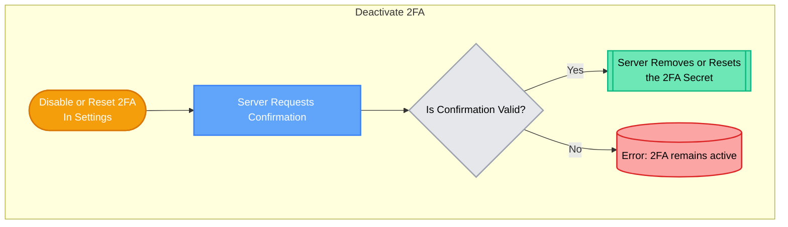

# Two-Factor Authentication (2FA) Overview

Two-Factor Authentication (2FA) is an additional security measure that helps protect your account even if your password is compromised. Once you enable 2FA in our system, every login attempt will require:

1. **Something you know:** your account credentials (username and password).
2. **Something you have:** a one-time passcode (TOTP) generated by your authenticator app.

Below is a quick look at the behind-the-scenes workflow that takes place once 2FA is enabled on your account.

## 2FA Login Process

When you have 2FA enabled, logging in requires two steps:

---

## 1. Generating Your 2FA Secret

When you first enable 2FA, the system creates a **unique secret key** just for your account. This secret key is used to generate time-based passcodes on your phone’s authenticator app (e.g., Google Authenticator, Authy).

- **QR Code:** To make setup easier, the frontend normally shows you a QR code that encodes this secret key. You scan it with your authenticator app so it knows how to generate your one-time codes.

- **Short-Lived:** This initial QR code is only valid for a short window (around 30 seconds), which prevents any attackers from reusing it later.

---

## 2. Verifying Your 2FA Setup

After scanning the QR code, you enter the 6-digit code from your authenticator app into the application:

1. **Real-Time Check:** The backend checks that the code you entered is correct for your secret key at that moment in time.
2. **Activating 2FA:** If the code matches, the backend system marks your account as “2FA enabled.” From this point on, you’ll need a fresh 6-digit passcode every time you log in.

---

## 3. Logging In with 2FA

Once your account has 2FA enabled, the login process involves two steps:

1. **Password Verification:** The first step is the same as before. You enter your username and password, and the system checks if they are correct.
2. **TOTP Verification:** If you have 2FA active, the system asks for your 6-digit passcode from your authenticator app:
    - **Time-Based:** The passcode changes every 30 seconds, thanks to your app and the server both using the same secret key and a synchronized clock.
    - **More Secure:** Even if someone got your password, they can’t log in without your phone’s one-time code.

---

## 4. Behind-the-Scenes Details

1. **Time Synchronization:** The backend server and your authenticator app use the current time to calculate the correct 6-digit code.
2. **Secret Key Storage:** Your secret key is securely stored in our database, encrypted to prevent unauthorized access.
3. **Rate Limiting:** If too many wrong 6-digit codes are entered consecutively, the backend system may temporarily lock the account to prevent brute-force attacks.

---

## 5. Disabling or Resetting 2FA

You can disable 2FA at any time via your account settings if you no longer want to use it. The system will verify that it’s truly you requesting the removal, so an attacker can’t just turn off 2FA on your behalf.

- **Reset / Regenerate:** If you lose access to your phone or authenticator app, you can request a new QR code. This invalidates your old secret key and issues a new one.

---

## 6. Why 2FA Matters

By requiring something you *know* (password) and something you *have* (your phone generating time-based codes), 2FA adds a powerful extra layer of security. Even if a hacker steals or guesses your password, they can’t access your account without your phone’s TOTP code. This significantly reduces the risk of unauthorized access and keeps your sensitive data much safer.

